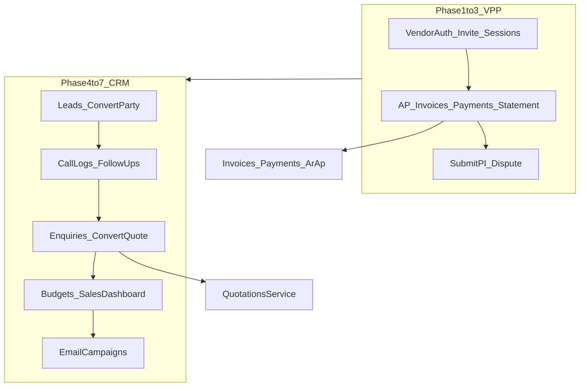

# Week 14 — Vendor Payment Portal + CRM

Backend-only, same as Week 13. Official weekly deliverable (Ch.24.3 + Ch.6): VPP + Leads / Call Logs / Enquiries / Follow-ups / Email Marketing / Budgets / 14 sales reports.

**Locked product rules**
- Do **not** reuse `PortalUser` / portal JWT for vendors. New identity: `VendorUser` + `VendorSession`, JWT `principal: 'vendor'`.
- CRM is **staff ERP** (`principal: 'user'`), tenant-scoped. Sales users never become portal/vendor users.
- Reuse domain services (`InvoicesService`, `PaymentsService`, `ArApService`, `QuotationsService`, `NotificationEmitterService`). Vendors do not post GL, edit other parties, or see cost/GP.
- Vendor invoice submit creates a **DRAFT `PURCHASE_INVOICE`** with `remarks` containing `vendor portal` + optional attachment; staff posts via existing `POST /purchase-invoices/:id/post`.
- Enquiry convert calls existing quotation create — no second quote pipeline.
- TDS certificate = stub (`501` / empty placeholder). India Phase 3.
- No UI. No Week 15 Air Import.

---

## Priority order

| P | Workstream | Why first |
|---|------------|-----------|
| 1 | VPP identity + invite + JWT isolation | Everything vendor-facing depends on this; same risk class as Week 13 portal |
| 2 | VPP read AP (invoices, payments, remittance, statement, schedule) | Highest vendor productivity; wraps existing AP |
| 3 | VPP writes (submit PI + dispute) + notifications | Completes Ch.24.3; staff review stays in ERP |
| 4 | CRM leads + convert-to-customer | Pipeline root; Party already exists |
| 5 | Call logs + follow-ups + enquiries | Daily sales work; enquiry → quotation |
| 6 | Salesperson budgets + 14 dashboard reports | Management visibility; reuse jobs/quotes/CRM tables |
| 7 | Email marketing (subscribers + campaigns) | Lowest ops-critical; last so it cannot block VPP/CRM core |

---

## P1 — VPP identity (mirror portal, do not share tables)

**Schema** (new migration, RLS like portal)
- `Party.vendor_portal_access` Boolean default `false` (do **not** overload `portal_access`)
- `VendorUser` — same shape as [`PortalUser`](prisma/schema.prisma): tenant, party, email unique per tenant, invite fields, `INVITED|ACTIVE|DISABLED`
- `VendorSession` — clone [`PortalSession`](prisma/schema.prisma)
- `VendorPermission` — party × `VendorDocumentType` (`PURCHASE_INVOICE`, `REMITTANCE`, `CREDIT_NOTE`, `STATEMENT`, `TDS_CERTIFICATE`) view/download
- Eligible party types for invite: `SUPPLIER`, `AIRLINE`, `SHIPPING_LINE`, `TRUCKER`, `CUSTOMS_BROKER`, `CFS_PORT_AGENT`, `WAREHOUSE`, `OVERSEAS_AGENT`, `AGENT`

**Auth isolation**
- Clone [`portal-auth.guard.ts`](src/modules/portal/guards/portal-auth.guard.ts) → `VendorAuthGuard`; secret `VENDOR_JWT_ACCESS_SECRET` (fallback documented, same as portal)
- JWT payload `{ principal: 'vendor', id, tenantId, partyId, sessionId }`
- Reject vendor tokens in [`jwt.strategy.ts`](src/modules/auth/strategies/jwt.strategy.ts) (already rejects `portal`)
- Reject staff tokens on `/vendor/*`

**APIs**
- `POST /vendor/auth/{login,accept-invite,refresh,logout}` · `GET /vendor/auth/me`
- Staff: `GET/POST /parties/:partyId/vendor-users`, status, reset-password, resend-invite
- Staff: `GET/PUT /parties/:partyId/vendor-permissions`
- Permissions: `vendor.manage_users`, `vendor.view_users`, `vendor.manage_permissions` — Tenant Admin + Finance Manager ([`permission-catalog.ts`](src/common/constants/permission-catalog.ts) + [`role-catalog.ts`](src/common/constants/role-catalog.ts))

Module: `src/modules/vendor/` registered in [`app.module.ts`](src/app.module.ts).

---

## P2 — VPP read (wrap existing AP)

Clone the customer finance wrap ([`portal-finance.service.ts`](src/modules/portal/portal-finance.service.ts)) with AR flipped to AP.

| Vendor API | Reuse |
|------------|--------|
| `GET /vendor/invoices` + `summary` + `:id` + `:id/pdf` | `InvoicesService.findAll(..., PURCHASE_INVOICE)` + `party_id` |
| `GET /vendor/invoices/export.csv` | Same CSV helper as portal |
| `GET /vendor/payments` | `PaymentsService.findAll({ direction: 'PAYMENT', party_id, status: POSTED })` |
| `GET /vendor/payments/:id/remittance.pdf` | New thin PDF from payment + allocations (no remittance PDF exists today) |
| `GET /vendor/credit-notes` | Purchase-side credit notes for that party if any; else empty list |
| `GET /vendor/advances` | Posted payments with `unallocated_amount > 0` |
| `GET /vendor/credit/aging` + `statement` + `statement.pdf` | [`ArApService.apAging`](src/modules/gl/ar-ap.service.ts) / `partyStatement(..., 'AP')` |
| `GET /vendor/schedule` | Open PIs with `due_date`, status paid/partial/overdue |
| `GET /vendor/payment-requests` | Read-only [`PaymentRequestsService.findAll({ party_id })`](src/modules/invoices/payment-requests.service.ts) |
| `GET /vendor/documents/tds` | Placeholder `{ available: false, phase: 'india_phase_3' }` |

Never return: GL vouchers, bank accounts, other parties, job cost/GP, internal notes.

---

## P3 — VPP writes + notifications

**Submit invoice**
- `POST /vendor/invoices/submit` (multipart PDF + amount/date/ref)
- Creates DRAFT `PURCHASE_INVOICE` via `createPurchaseInvoice`, stores file on the invoice/doc path, remarks include `vendor portal`
- Notify finance via `notifyFinanceStaff` (`VENDOR_INVOICE_SUBMITTED`)

**Disputes**
- New `VendorDispute` (do not attach `portal_user_id` to vendor threads)
- `POST/GET /vendor/disputes`, `GET /vendor/disputes/:id`
- Staff: `GET/PATCH /vendor-admin/disputes` (clone [`PortalAdminInboxController`](src/modules/portal/portal-ccp.controller.ts) review flow)
- Permission: `vendor.manage_disputes`

**NotificationType add:** `VENDOR_INVOICE_SUBMITTED`, `VENDOR_PAYMENT_POSTED`, `VENDOR_DISPUTE`
- Extend [`Notification`](prisma/schema.prisma) with optional `vendor_user_id`
- Emitter: `notifyVendorUser` / `notifyPartyVendorUsers` (clone portal helpers)
- Hook [`payments.service.ts`](src/modules/gl/payments.service.ts) post of `PAYMENT` → notify vendor party

---

## P4 — CRM leads

Staff module `src/modules/crm/` — Pattern C from [`module-template.md`](docs/module-template.md).

**`Lead`:** company, contact, email/phone, `potential_volume`, `service_requirements`, `source` (referral/cold_call/email/exhibition/website), `status` (New/InProgress/Qualified/ProposalSent/Won/Lost/OnHold), `assigned_salesperson_id`, priority, tags, `converted_party_id`

**APIs:** `GET/POST /crm/leads`, `GET/PATCH /crm/leads/:id`, `GET /crm/leads/pipeline` (group by status), `POST /crm/leads/import` (CSV, reuse party import style), `POST /crm/leads/:id/convert` → create/update `Party` type `CUSTOMER` + link.

**`LeadActivity`:** timeline rows for status changes, calls, follow-ups, notes.

Permissions: `crm.view`, `crm.create`, `crm.update`, `crm.delete` — Tenant Admin, Sales Manager, Sales Executive (own records; managers see team). SuperAdmin stays on platform console only.

---

## P5 — Call logs, follow-ups, enquiries

**`CallLog`:** `date_time`, `lead_id` XOR `party_id`, contact, `call_type` (Visit/Phone/Video/Email), purpose, summary, outcome, next_action, `next_followup_date`, optional GPS, duration, attachment. Write a `FollowUp` when `next_followup_date` set.

**`FollowUp`:** due_date, owner, status, related lead/party/enquiry, reminder flag. `GET /crm/follow-ups` (mine vs manager `team=true`), `PATCH` complete/reschedule, `GET /crm/follow-ups/calendar`. Cron (clone scheduler overdue) → `FOLLOW_UP_DUE` to assigned salesperson.

**`Enquiry`:** service_type (`JobType`), origin/dest ports, cargo, incoterms, special_requirements, status New/Quoted/Booked/Lost/Cancelled, `lead_id`?, `party_id`?, `quotation_id`?. `POST /crm/enquiries/:id/convert-to-quote` → [`QuotationsService.create`](src/modules/quotations/quotations.service.ts) with `customer_id` + `salesperson_id`, set status Quoted.

Daily call sheet: `GET /crm/call-logs/daily?date=&salesperson_id=`.

---

## P6 — Budgets + 14 sales dashboard reports

**`SalespersonBudget`:** salesperson + period (month/quarter/year) + optional `job_type` + target amount/volume.

**`GET /crm/dashboard`** (and/or `/crm/reports/:type`) — 14 types from the plan, all tenant-scoped:

1. weekly sales  
2. monthly sales  
3. salesman revenue + volume  
4. customer-wise revenue  
5. top 10 customers  
6. top 10 salesmen  
7. trade lane analysis  
8. service type analysis  
9. win/loss (quotations + leads)  
10. call log summary  
11. lead pipeline  
12. budget vs actual  
13. enquiry conversion  
14. follow-up overdue / completion  

Reuse job revenue (`Job.revenue_total`, `salesperson_id`) and existing [`/quotations/reports/analytics*`](src/modules/quotations/quotations.controller.ts). Do not duplicate quotation analytics — wrap them.

---

## P7 — Email marketing (last)

- `CrmSubscriber` (or reuse Party `marketing_subscription` + explicit subscriber rows for prospects)
- CSV import + unsubscribe
- `EmailCampaign` + templates; send now / schedule (cron)
- Delivery counts: sent/failed via existing [`EmailService`](src/shared/email/email.service.ts) / `EmailLog` (opened/delivered only if provider supports — otherwise sent/failed)
- Scope: filtered groups by party type / country / tags — not a full ESP

---

## Consistency checklist (system-wide)

| Concern | How Week 14 stays consistent |
|---------|------------------------------|
| Hierarchy | SuperAdmin ≠ Tenant Admin ≠ staff ≠ vendor user |
| JWT | Three principals: `user` / `portal` / `vendor` — mutually rejected |
| API shape | `{ success, data, meta }` + Swagger + `forbidNonWhitelisted` DTOs |
| Tenant/RLS | Every new table `tenant_id` + `enable_rls_for_table` |
| Permissions | Catalog + `POST /tenants/sync-permissions` |
| Notifications | Same emitter; new types; no circular Nest imports (Notifications stays Prisma-only) |
| Ownership | Vendor sees only `party_id = vendor.partyId`; CRM salesperson filter for executives |
| Quotes/jobs | CRM never creates Jobs; convert enquiry → quotation only |

**Out of scope:** UI, customer payment gateway, WhatsApp CRM, NVOCC enquiries (Week 20), Air Import (Week 15), real TDS certificates.

---

## Suggested implementation sequence after you approve

1. Schema + vendor auth/invite/permissions  
2. Vendor finance reads + remittance PDF + schedule  
3. Vendor submit PI + disputes + payment posted notify  
4. CRM leads + convert + pipeline + CSV  
5. Call logs + follow-ups + cron + enquiries→quote  
6. Budgets + dashboard reports  
7. Email campaigns  

After each slice: Swagger, party isolation tests, `sync-permissions`.
