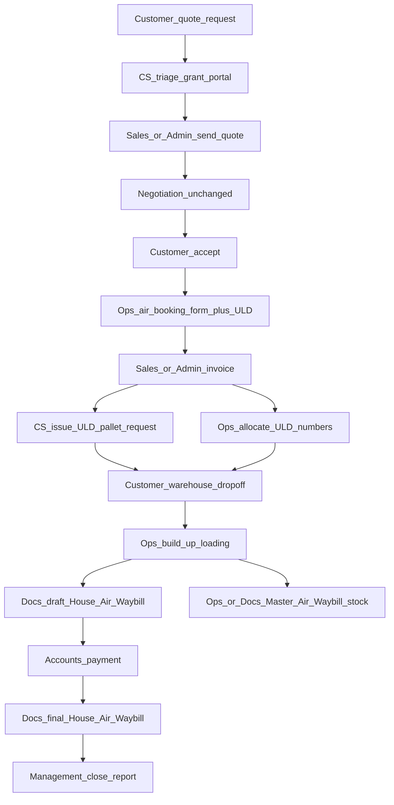
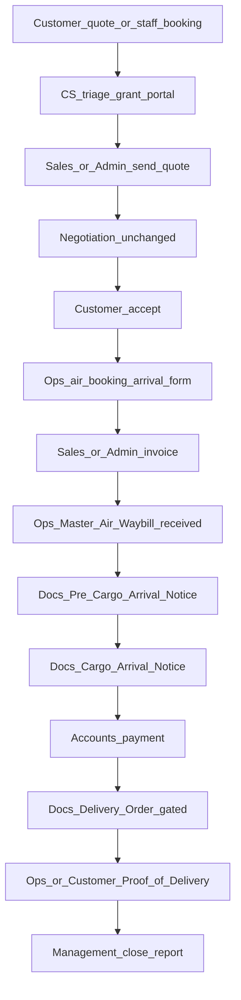

# Air Freight department workflow — implementation plan

> **Update (2026-09):** Air pallet types (`AirPalletType`) and the ULD request / allocate / portal drop-off path were **removed**. Export path is now: commercial prefix → air booking form → invoice → `BUILD_UP` → HAWB draft/final → close. Historical ULD sections below are obsolete.

> Product scope locked by user: **both** `AIR_EXPORT` and `AIR_IMPORT`.  
> Remaining design choices below are **recommended defaults** with rationale.  
> Mirror of [NVOCC Sea Export workflow](./decision.md) (CS → Sales → Ops → Docs → Accounts → Management), adapted to air documents and import delivery cycle.  
> Do **not** force this onto Sea Full Container Load Export or Non-Vessel Operating Common Carrier stages.

**Abbreviations (full form first use):**

| Short | Full form |
|-------|-----------|
| HAWB | House Air Waybill |
| MAWB | Master Air Waybill |
| CAN | Cargo Arrival Notice |
| DO | Delivery Order |
| POD | Proof of Delivery |
| ULD | Unit Load Device (air pallet / container used on aircraft) |
| CS | Customer Support |
| Ops | Operations |
| Docs | Documentation |
| AWB | Air Waybill (generic; stock is usually Master Air Waybill numbers) |

---

## Locked product rules

| Rule | Decision |
|------|----------|
| Job types | `AIR_EXPORT` **and** `AIR_IMPORT` |
| Commercial front | Same as Non-Vessel Operating Common Carrier: quote request → CS triage / portal grant → Sales or Admin send quote → **existing negotiation unchanged** → customer accept |
| Sales invoices | Keep Admin; Sales Manager / Executive already have invoice create/send — reuse |
| Sea Full Container Load / Non-Vessel Operating Common Carrier | Out of scope for this stage machine |
| Air pallet master + booking form | **REMOVED** — booking form remains without pallet FK; no ULD flow |

---

## Recommended choices (why + how)

### 1. Shared stage engine, air-specific stage enum — **Recommended**

**Choice:** Extract a thin shared `WorkflowStageGuard` (role → department → allowed stage), used by Non-Vessel Operating Common Carrier and Air. Keep **`AirWorkflowStage`** as its own enum on `AirJobDetail` (not reuse `NvoccWorkflowStage`).

**Why:** Same department ownership and Admin override behaviour without coupling air stages to sea Non-Vessel Operating Common Carrier names (`CRO_ISSUED`, `PORT_TOKEN`, etc.). Avoids a second copy-paste of role maps that will drift.

**How:** Move role→department map to `src/common/workflow/` (or shared under jobs). Air and Non-Vessel Operating Common Carrier each register their stage order + owner map.

---

### 2. Unit Load Device / pallet request (not sea Container Release Order) — **Recommended**

**Choice:** New **`AirUldRequest`** (+ lines) for export: staff manual form (airline, flight, Unit Load Device type from `AirPalletType`, count, CFS / warehouse, cutoff). Ops **allocates** Unit Load Device / pallet identifiers (tenant sequence). Portal-visible after issue.

**Why:** Air does not use Container Release Order / DP World semantics. Customers still need something like “your pallets / Unit Load Device slots are ready” before drop-off. Reuses `AirPalletType` specs already seeded.

**Import:** No Unit Load Device release form. Import uses **flight + Master Air Waybill received** and warehouse receipt instead of yard pick.

---

### 3. Document gates — **Recommended**

| Direction | Draft / early doc | Payment-gated “release” doc | Later delivery |
|-----------|-------------------|-----------------------------|----------------|
| **Export** | Draft **House Air Waybill** (portal may request) | Final / issued **House Air Waybill** after Accounts confirm payment | **Master Air Waybill** issued by Ops/Docs when stock allocated (not payment-gated — airline stock timing) |
| **Import** | **Pre–Cargo Arrival Notice** / **Cargo Arrival Notice** after flight arrival data | **Delivery Order** after Accounts confirm payment (and duties cleared if you already track customs) | **Proof of Delivery** after customer/warehouse confirm delivery |

**Why:**

- Export: House Air Waybill is the customer-facing bill (like House Bill of Lading). Payment before final House Air Waybill matches the Non-Vessel Operating Common Carrier original Bill of Lading gate.
- Master Air Waybill is airline stock / consolidation — gating it on customer payment would block Ops incorrectly.
- Import: There is no “original House Air Waybill” release in the same sense; **Delivery Order** is the commercial release gate. Cargo Arrival Notice informs; Proof of Delivery closes the physical handoff.

---

### 4. Portal customer steps — **Recommended**

| Export | Import |
|--------|--------|
| View Unit Load Device / pallet request + numbers | View arrival / Cargo Arrival Notice when issued |
| Confirm **cargo drop-off / received at warehouse** (replaces yard pick) | Confirm **cargo collected** or acknowledge ready for pickup (optional) |
| Request draft House Air Waybill | Request Delivery Order (after Cargo Arrival Notice + payment path) |
| **No port gate token** | **No port gate token** |

**Why drop port token:** Sea Non-Vessel Operating Common Carrier port gate is terminal-specific. Air handoff is warehouse / airline ramp — a false “port token” would confuse users. Warehouse drop-off + Delivery Order / Proof of Delivery cover the real controls.

---

### 5. Negotiation / Sales / Admin — **Recommended: same as Non-Vessel Operating Common Carrier**

Keep portal negotiate / accept-reject; Admin keeps send quote + send invoice; Sales already has invoice create/send. No redesign.

---

## Target workflows

### Air Export (`AIR_EXPORT`)

### Air Import (`AIR_IMPORT`)

---

## Stage enums (proposed)

### Shared commercial prefix (both directions)

`QUOTE_REQUESTED` → `CS_TRIAGED` → `QUOTE_SENT` → `CUSTOMER_ACCEPTED` → `BOOKING_FORM_COMPLETE` → `INVOICE_SENT`

### Export-only continuation

`ULD_REQUEST_ISSUED` → `ULD_ALLOCATED` → `CARGO_DROPPED_OFF` → `BUILD_UP` → `DRAFT_HAWB_ISSUED` → `PAYMENT_RECEIVED` → `FINAL_HAWB_ISSUED` → `MAWB_ISSUED` → `CLOSED`

*(Master Air Waybill may complete in parallel after build-up; Management close requires final House Air Waybill + payment.)*

### Import-only continuation

`MAWB_RECEIVED` → `PRE_CAN_ISSUED` → `CAN_ISSUED` → `PAYMENT_RECEIVED` → `DELIVERY_ORDER_ISSUED` → `POD_RECEIVED` → `CLOSED`

Store on `AirJobDetail`: `workflow_stage`, `stage_changed_at`, `stage_changed_by`, `stage_override_reason`, payment / draft timestamps analogous to Non-Vessel Operating Common Carrier.

---

## Schema / migration (high level)

All `tenant_id` + row-level security:

1. **`AirWorkflowStage` enum** + columns on `AirJobDetail`
2. **Extend `AirBookingForm`** — export: shipper/consignee/notify, commodity, dangerous goods, flight, airport pair, Unit Load Device type FK (already), pieces/weights; import: arrival flight, Master Air Waybill from origin, agent at origin, notify, delivery address, customs value flags
3. **`AirUldRequest` + `AirUldRequestLine`** (export) — Unit Load Device type, count, numbers nullable until allocate; `portal_visible_at`; optional PDF via `DocumentType` (e.g. `ULD_REQUEST` or reuse `OTHER` with typed metadata — prefer new enum value)
4. **Tenant Unit Load Device number sequence** (export allocate)
5. **Gates:** `draft_hawb_requested_at`, `draft_hawb_issued_at`, `final_hawb_issued_at`, `payment_confirmed_at`; import: `delivery_order_requested_at`, `delivery_order_issued_at`, `pod_received_at`
6. **Reuse** existing House Air Waybill / Master Air Waybill / Pre–Cargo Arrival Notice / Cargo Arrival Notice / Delivery Order / Proof of Delivery PDF generators — wrap with stage + payment checks
7. **Air Waybill stock** — Master Air Waybill allocate stays on existing `/awb-stock` module; workflow stage advances when Docs/Ops marks Master Air Waybill issued on the job

---

## API surface (proposed)

### Staff — shared / by job

| Method | Path | Notes |
|--------|------|-------|
| `POST` | `/jobs/:id/air/cs-triage` | CS; grant portal on billing/shipper party |
| `POST` | `/jobs/:id/air/mark-quote-sent` | Sales / Admin |
| `GET` / `PUT` | `/jobs/:id/air-booking-form` | **Extend** existing; Ops; validates mandatory by `job_type` |
| `POST` | `/jobs/:id/air/send-invoice` | Sales / Admin; marks `INVOICE_SENT` |
| `POST` | `/jobs/:id/air/accounts/confirm-payment` | Accounts |
| `POST` | `/jobs/:id/air/close-report` | Management |

### Staff — export

| Method | Path |
|--------|------|
| `POST` | `/jobs/:id/air/uld-requests` |
| `POST` | `/jobs/:id/air/uld-requests/:rid/issue` |
| `POST` | `/jobs/:id/air/uld-requests/:rid/allocate` |
| `POST` | `/jobs/:id/air/stage/build-up` |
| `POST` | `/jobs/:id/documents/hawb-draft-gated` |
| `POST` | `/jobs/:id/documents/hawb-final-gated` |
| `POST` | `/jobs/:id/documents/mawb` (existing) + stage advance helper |

### Staff — import

| Method | Path |
|--------|------|
| `POST` | `/jobs/:id/air/stage/mawb-received` |
| `POST` | `/jobs/:id/documents/pre-can-gated` |
| `POST` | `/jobs/:id/documents/can-gated` |
| `POST` | `/jobs/:id/documents/delivery-order-gated` |
| `POST` | `/jobs/:id/air/stage/pod` (or existing POD receive) |

### Portal

| Method | Path | Direction |
|--------|------|-----------|
| `GET` | `/portal/shipments/:id/uld-requests` | Export |
| `POST` | `/portal/shipments/:id/cargo/confirm-dropoff` | Export |
| `POST` | `/portal/shipments/:id/request-draft-hawb` | Export |
| `POST` | `/portal/shipments/:id/request-delivery-order` | Import |
| `GET` | existing docs hub for House Air Waybill / Cargo Arrival Notice / Delivery Order / Proof of Delivery | Both |

Permissions: reuse `jobs.view` / `jobs.update` + role→department stage guards (same pattern as Non-Vessel Operating Common Carrier `nvocc.manage` + dept map). Prefer **not** exploding a new permission matrix unless the frontend needs it.

---

## Implementation phases

1. Schema: `AirWorkflowStage`, booking form extensions, Unit Load Device request models, gate timestamps, row-level security  
2. Shared stage guard service (extract from Non-Vessel Operating Common Carrier) + air owner maps (export vs import)  
3. Extend air booking form validation by `AIR_EXPORT` / `AIR_IMPORT`  
4. Export: Unit Load Device request + allocate + portal visibility  
5. Portal: drop-off, request draft House Air Waybill, request Delivery Order  
6. Docs gates: House Air Waybill draft/final; import Cargo Arrival Notice / Delivery Order + payment  
7. Management close-report packs (export vs import fields)  
8. Swagger / testing guide Part G3 smoke (export + import)  
9. Update `decision.md` + `flow.md`

---

## Acceptance (smoke)

**Export**

1. Portal quote → CS triage → Sales/Admin send → negotiate → accept  
2. Ops completes air booking form (Unit Load Device type + specs shown)  
3. Sales/Admin invoice → CS Unit Load Device request → Ops allocate → customer sees on portal  
4. Customer confirm warehouse drop-off → Ops build-up  
5. Customer requests draft House Air Waybill → Docs issues draft  
6. Accounts payment → Docs final House Air Waybill (blocked before payment)  
7. Master Air Waybill issued (stock) → Management close report  
8. Wrong department → 403  

**Import**

1. Same commercial prefix through booking form + invoice  
2. Ops Master Air Waybill received → Docs Pre–Cargo Arrival Notice / Cargo Arrival Notice  
3. Accounts payment → Docs Delivery Order (blocked before payment)  
4. Proof of Delivery → Management close  
5. Wrong department → 403  

---

## Explicitly out of scope

- Live airline Application Programming Interface booking  
- Electronic Air Waybill network submission beyond existing queue stubs  
- Forcing Non-Vessel Operating Common Carrier Container Release Order onto air  
- Sea Full Container Load stage machine  
- Frontend UI  

---

## Open only if product later disagrees

| Topic | Current recommendation |
|-------|------------------------|
| Delivery Order also requires customs clearance complete | Soft-warn first; hard gate later if Ops needs it |
| Import without a portal quote (staff-created job) | Allow Admin override to jump to `BOOKING_FORM_COMPLETE` |
| Consol multi-house under one Master Air Waybill | Stage on master job; houses inherit document visibility via existing parent/house job links |

---

*Approve this plan (or note changes) before implementation.*
