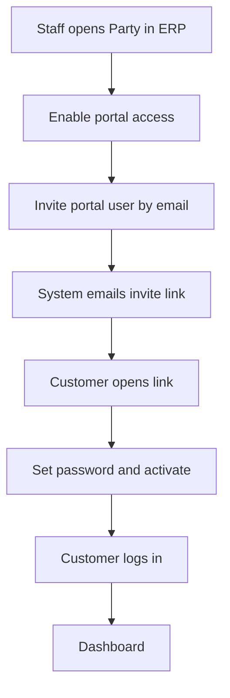
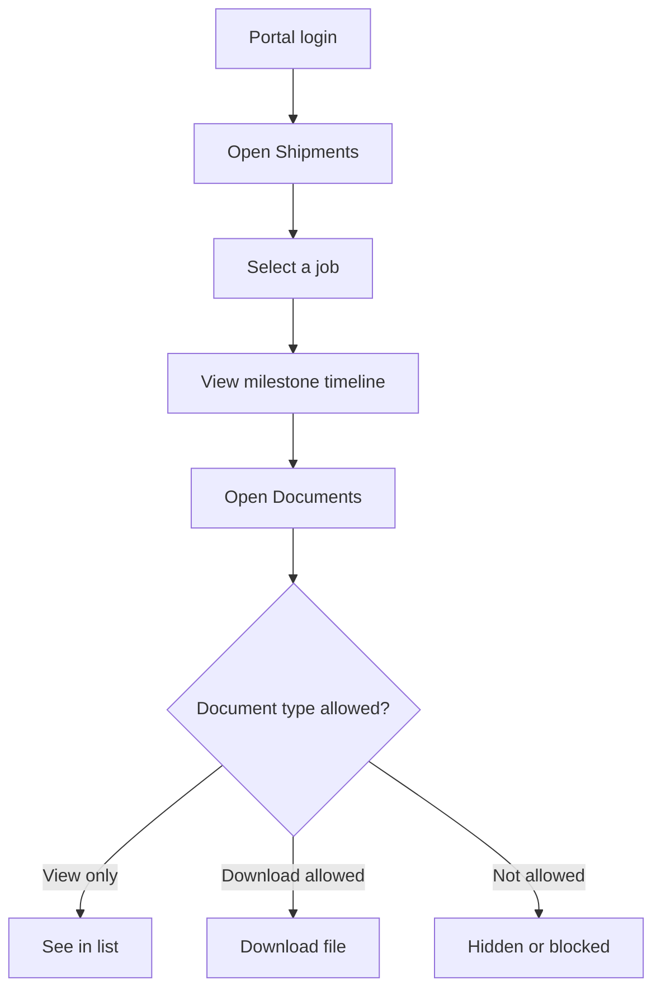
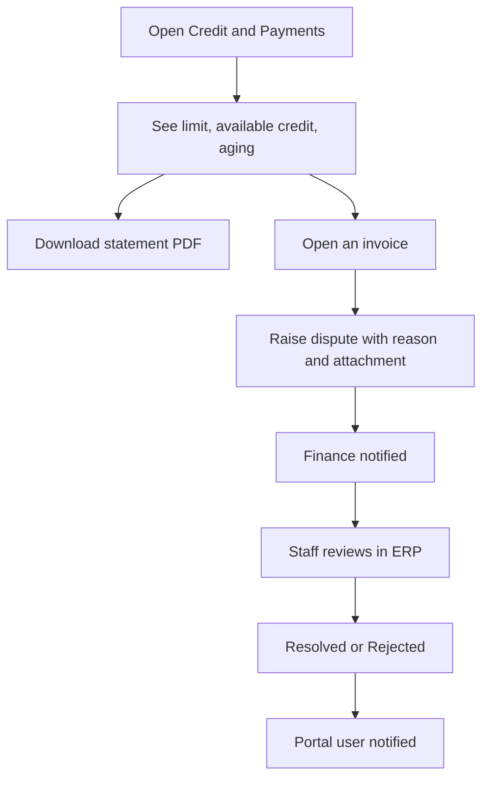
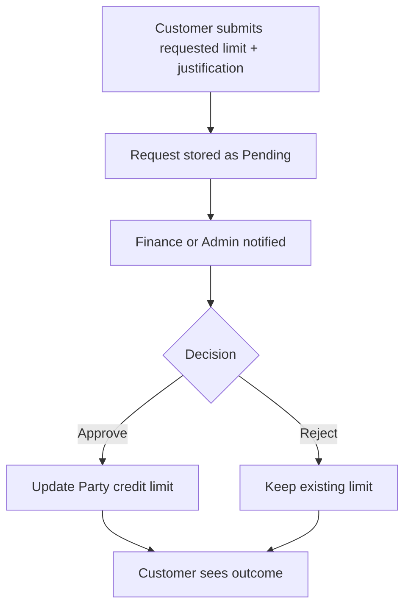
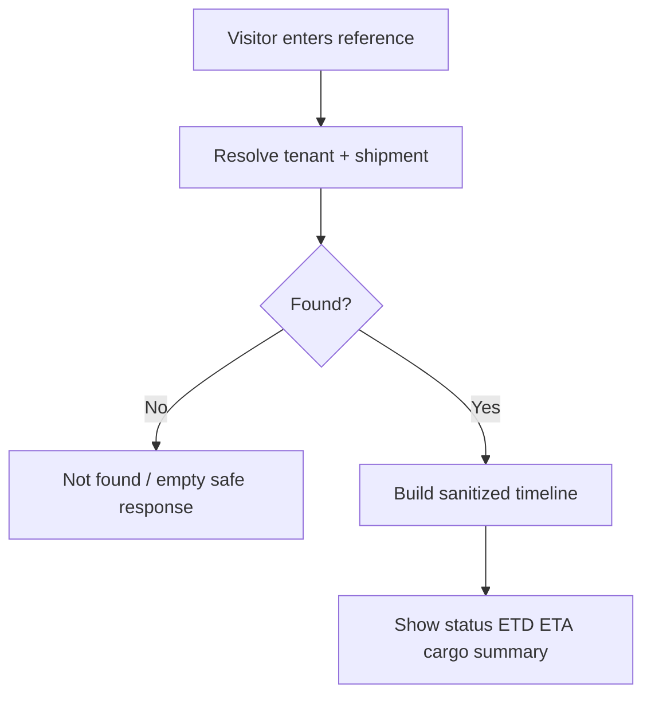
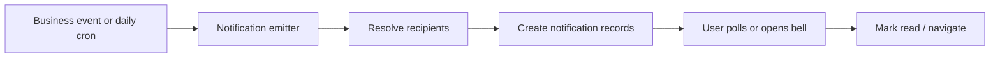

# Customer Portal — Functional Specification

**Project:** KingFisher Wings / Fresa Gold ERP  
**Phase:** 2 · Week 13  
**Spec chapters:** Ch.24.1 (Customer Web Portal), Ch.19.5 (Customer Credit Portal), Ch.24.2 (Track & Trace), in-app notifications  
**Audience:** Product, backend, frontend, QA, operations  
**Companion plan:** `docs/WEEK13_CUSTOMER_PORTAL_PLAN.md`  
**Status:** Pre-implementation specification (no implementation code in this document)

---

## 1. Purpose

The Customer Portal lets a **customer organisation** (a Party marked for portal access) log in with their own credentials and self-serve shipment tracking, documents, invoices, credit information, quotations, and communication with the forwarder — without using the staff ERP.

Week 13 also delivers two closely related capabilities that share the same release:

| Capability | Audience | Login required? |
|------------|----------|-----------------|
| **Customer Portal (CCP)** | Invited customer users | Yes — portal login |
| **Public Track & Trace** | Anyone with a reference number | No |
| **In-app notifications** | Staff (ERP) and portal users | Yes — staff or portal login |

This document describes **sub-modules, actors, business rules, processes, and flows** for the Customer Portal and its companion features. It does not include source code, schema scripts, or API payload examples.

---

## 2. Goals and non-goals

### 2.1 Goals

1. Customers see **only their own** operational and financial data.
2. The forwarder controls **which document types** each customer may view or download.
3. Customers can manage day-to-day visibility of shipments, invoices, and credit without calling the office for every update.
4. Anyone can track a shipment publicly by job, BL, or AWB reference with a **safe, non-financial** summary.
5. Staff and portal users receive **in-app alerts** for important events, with click-through to the related record.
6. Portal authentication is **fully isolated** from staff ERP authentication.

### 2.2 Non-goals (explicitly out of Week 13)

| Out of scope | Deferred to |
|--------------|-------------|
| Vendor Payment Portal (VPP) | Week 14 |
| CRM / leads / call logs | Week 14 |
| Air Import operational depth | Week 15 |
| HR document-expiry workflows (full) | Week 16 (emitter may be stubbed) |
| Mobile app | Deferred (Ch.26) |
| WhatsApp as primary portal channel | Optional later; email + in-app first |
| Real-time WebSocket push | Optional later; polling is acceptable for v1 |
| Customer editing of jobs, invoices, or quotes | Never in v1 — read-only ops data + request forms only |

---

## 3. Actors and responsibilities

| Actor | Who they are | What they can do |
|-------|--------------|------------------|
| **Tenant Admin / CS** | Forwarder staff | Enable portal on a party, invite/disable portal users, configure document rights |
| **Finance staff** | Forwarder staff | See disputes, credit-limit requests, payment/overdue notifications; resolve disputes; approve/reject limit requests |
| **Ops / Sales staff** | Forwarder staff | Receive milestone / quotation notifications in ERP |
| **Portal user** | Person invited for a customer Party | Log in to portal; view own data; download allowed docs; raise disputes; request credit increase; contact forwarder |
| **Anonymous visitor** | Public internet user | Enter a reference on Track & Trace; see sanitized shipment status only |
| **System** | Crons and domain events | Create notifications, enforce session expiry, apply ownership filters |

---

## 4. Customer Portal — sub-module map

The Customer Portal is one product surface composed of the following **sub-modules**.

```text
Customer Portal
├── 4.1  Portal Access & Identity
├── 4.2  Portal Session & Security
├── 4.3  Dashboard
├── 4.4  Shipments (Track inside portal)
├── 4.5  Documents & Document Rights
├── 4.6  Invoices & Payments
├── 4.7  Customer Credit Portal (CCP)
├── 4.8  Quotations (read-only)
├── 4.9  Contact Forwarder
├── 4.10 Disputes
├── 4.11 Credit Limit Requests
├── 4.12 Portal Notifications
└── 4.13 Staff Portal Administration (ERP side)
```

Companion modules in the same week (not inside the logged-in portal shell, but part of the Week 13 deliverable):

```text
Week 13 companions
├── Public Track & Trace (+ embeddable widget)
└── Staff In-app Notifications (ERP topbar)
```

---

## 5. Sub-module specifications

### 5.1 Portal Access & Identity

**Purpose:** Decide who may use the portal and create their login identity.

**Concepts:**
- A **Party** (customer) must have **portal access enabled** by staff before invites are allowed.
- A **Portal User** is a person account linked to exactly one Party within a tenant.
- Status lifecycle: **Invited → Active → Disabled** (and soft-removed if needed).

**Staff process — enable and invite:**
1. Open the customer Party in the ERP.
2. Turn on portal access for that Party.
3. Invite one or more portal users (name, email, optional phone).
4. System sends an invite email with an activation link.
5. Customer sets a password and activates the account.
6. Customer can log in.

**Business rules:**
- Invite is rejected if portal access is off for the Party.
- Email is unique per tenant among portal users.
- Disabled users cannot log in; existing sessions are revoked.
- Portal users are **not** staff users and do not appear in the Users admin list as employees.

---

### 5.2 Portal Session & Security

**Purpose:** Authenticate portal users without sharing staff ERP tokens.

**Rules:**
- Separate portal login, refresh, and logout from staff auth.
- Access session is **short-lived** (target: 4 hours).
- Refresh is only available through the portal auth flow.
- Portal credentials never authorize staff ERP routes.
- Staff credentials never authorize portal routes.
- Logout revokes the current portal session.
- Password change / disable account revokes active portal sessions.

**Security principles:**
- Every portal data request is scoped to the logged-in user’s **tenant** and **Party**.
- Cross-customer access returns “not found” behaviour (no confirmation that another customer’s record exists).
- Document downloads require both ownership and document-type permission.

---

### 5.3 Dashboard

**Purpose:** First screen after login — operational and financial snapshot.

**Typical widgets (v1):**
- Count of open / in-transit / recently completed shipments
- Outstanding AR balance (high level)
- Unread portal notification count
- Shortcuts: Shipments, Invoices, Credit, Contact Forwarder

**Rules:**
- All figures are Party-scoped.
- No other customers’ data.
- No internal GP / cost metrics.

---

### 5.4 Shipments (in-portal Track & Trace view)

**Purpose:** List and detail the customer’s jobs with milestone timeline.

**List shows (examples):**
- Job number, job type, status
- Origin / destination (names)
- ETD / ETA
- Status badge

**Detail shows:**
- Cargo summary (pieces, weight, volume as available)
- Parties visible to the customer in a safe way (e.g. own company as shipper/consignee context)
- Milestone timeline (name, status, completed time)
- Link to documents for that job

**Ownership rule (v1 — product decision):**  
A shipment belongs to the portal Party if that Party is the **shipper** or the **consignee** on the job.

**Rules:**
- Read-only; customers cannot edit milestones or job fields.
- Jobs belonging to other Parties are invisible.
- Soft-deleted or non-existent jobs are not exposed.

---

### 5.5 Documents & Document Rights

**Purpose:** Let customers see and download documents the forwarder allows.

**Document types (catalogue examples):**  
HAWB, MAWB, HBL, MBL, Invoice, Credit Note, Statement, CAN, DO, POD, Pre-alert, Other.

**Two layers of control:**

| Layer | Meaning |
|-------|---------|
| **Existence** | Document was generated/stored on the job or invoice |
| **Permission** | Forwarder allowed this Party to view and/or download that type |

**Customer experience:**
- Document list on a shipment shows only types with **view** permission.
- Download button appears only when **download** permission is granted.
- Missing permission → document omitted or download denied.

**Staff experience (ERP admin):**
- Per-customer matrix: document type × view × download toggles.
- Defaults can favour view-on / download-off until staff opens rights.

---

### 5.6 Invoices & Payments

**Purpose:** Customer visibility of billed amounts and payment history.

**Customer can:**
- List own invoices (number, date, due date, status, amounts)
- Open invoice detail
- Download invoice PDF when permitted
- View payment history against their account
- View credit notes applied to them

**Rules:**
- Only invoices (and related credit notes) for the portal Party.
- No purchase invoices or vendor documents.
- No ability to post payments inside the portal in v1 (view history only unless product later adds a gateway).

---

### 5.7 Customer Credit Portal (CCP)

**Purpose:** Self-service credit and AR transparency (Ch.19.5).

**Customer can see:**
- Credit limit
- Credit used / available (derived from outstanding AR vs limit)
- Credit status (e.g. active / on hold) at a high level if exposed by product policy
- Aging breakdown (current, 30, 60, 90+)
- Download aging / account statement PDF

**Customer can request:**
- Credit limit increase (justification required) — see §5.11
- Invoice dispute — see §5.10

**Rules:**
- CCP is read-mostly; limit changes require staff approval.
- Statement content is Party-scoped AR only.

---

### 5.8 Quotations (read-only)

**Purpose:** Customer sees quotations the forwarder sent to them.

**Shows:**
- Quote number, status, validity, currency, totals (customer-facing amounts)
- Optional read-only line summary per product policy

**Rules:**
- Only quotations where the customer Party is the quote customer.
- No internal cost, GP, or approval-chain internals unless product explicitly allows a customer-safe subset.
- No edit or approve actions in portal v1 (approval remains staff/ERP unless later extended).

---

### 5.9 Contact Forwarder

**Purpose:** Structured messaging from customer to forwarder without leaving the portal.

**Customer provides:**
- Subject, message body
- Optional link to a shipment and/or invoice
- Optional attachment

**System behaviour:**
- Stores the message against the Party and portal user
- Notifies relevant staff (CS / ops)
- Customer can see their own sent messages (simple history)

**Rules:**
- Not a full chat system in v1 (no threaded staff replies inside portal unless added later).
- Staff read/acknowledge in ERP admin inbox.

---

### 5.10 Disputes

**Purpose:** Customer challenges an invoice formally.

**Customer provides:**
- Invoice reference
- Reason, description
- Optional supporting attachment

**Lifecycle:** Open → Under review → Resolved or Rejected

**System behaviour:**
- Validates the invoice belongs to the Party
- Notifies finance
- Staff update status and optional notes in ERP
- Portal user can see status of their disputes

---

### 5.11 Credit Limit Requests

**Purpose:** Customer asks for a higher credit limit.

**Customer provides:**
- Requested limit
- Justification

**Lifecycle:** Pending → Approved or Rejected

**System behaviour:**
- Captures current limit at request time for audit
- Notifies finance / tenant admin
- Staff approval may update the Party credit limit in ERP (business process); portal reflects outcome

---

### 5.12 Portal Notifications

**Purpose:** In-portal bell and list for the customer user.

**Examples of portal-relevant alerts:**
- Dispute status changed
- Credit limit request decided
- Optional: shipment milestone reached (if product enables customer-facing milestone alerts)

**Customer can:**
- See unread count
- List notifications (unread first)
- Mark one or all as read
- Click through to related portal screen when a link is provided

---

### 5.13 Staff Portal Administration (ERP)

**Purpose:** Forwarder controls portal identity, rights, and CCP follow-ups.

| Admin function | Description |
|----------------|-------------|
| Enable portal access on Party | Master switch |
| Invite / disable portal users | Identity management |
| Document rights matrix | Per customer, per document type |
| Messages inbox | Read customer contact messages |
| Disputes desk | Review and resolve |
| Credit limit request desk | Approve or reject |

Staff permissions (conceptual): manage portal users, manage document permissions, view messages, manage disputes, manage credit requests.

---

## 6. Companion: Public Track & Trace

**Purpose:** Website / shareable lookup without login (Ch.24.2).

**Visitor process:**
1. Enter reference (job number, BL number, or AWB number).
2. System resolves the shipment within the correct tenant context.
3. Visitor sees current status, milestone timeline, ETD/ETA, and cargo summary.

**Visibility rules (mandatory):**
- **Allowed:** status, milestones, dates, ports/airports names, high-level cargo measures, vessel/flight identifiers if already public on the job.
- **Forbidden:** charges, costs, GP, internal notes, staff contacts, other parties’ confidential details, invoice amounts, credit data.

**Embeddable widget:**
- Forwarder can embed a branded snippet on their own website.
- Branding is the **tenant/company** brand — not Fresa/KingFisher marketing chrome.

**Abuse controls:**
- Rate limiting on public lookup.
- Ambiguous or foreign-tenant references return empty / not found without leaking existence across tenants.

---

## 7. Companion: Staff in-app notifications

**Purpose:** ERP topbar alerts for operational and financial events.

### 7.1 Core trigger set (Week 13)

| # | Event | Typical recipients |
|---|--------|-------------------|
| 1 | Invoice overdue | Finance |
| 2 | Job milestone updated | Assigned ops (and related roles as configured) |
| 3 | Quotation approved / rejected | Salesperson |
| 4 | Payment received | Finance |
| 5 | PDC maturity approaching | Finance |
| 6 | Document expiry | HR (may be stubbed until HR module) |
| 7 | Credit limit exceeded | Finance |

### 7.2 Portal-originated staff alerts

| Event | Typical recipients |
|-------|-------------------|
| Customer contacted forwarder | CS / Ops |
| Invoice dispute raised | Finance |
| Credit limit increase requested | Finance / Tenant Admin |

### 7.3 Staff UX

- Bell with unread badge
- Dropdown of latest items
- Full history page with type filter
- Mark one / mark all read
- Click-through to job, invoice, quotation, or admin desk

---

## 8. End-to-end processes

### 8.1 Onboarding a customer to the portal



### 8.2 Daily shipment self-service



### 8.3 CCP — review credit and raise a dispute



### 8.4 Credit limit increase



### 8.5 Public Track & Trace



### 8.6 Notification pipeline (conceptual)



---

## 9. Cross-cutting business rules

### 9.1 Data isolation

| Rule | Description |
|------|-------------|
| Tenant isolation | Portal user never crosses tenants |
| Party isolation | Portal user never sees another Party’s jobs, invoices, quotes, or documents |
| Auth isolation | Portal tokens ≠ staff tokens |
| Document dual gate | Ownership **and** type permission required |

### 9.2 Read vs write in portal

| Allowed writes (v1) | Not allowed |
|---------------------|-------------|
| Accept invite / set password / login | Edit jobs or milestones |
| Contact forwarder message | Edit invoices or post AR |
| Raise dispute | Approve quotations |
| Request credit limit increase | Change Party master data |
| Mark notifications read | Configure document rights (staff only) |

### 9.3 Branding and public surfaces

- Portal UI may use tenant branding.
- Public Track & Trace widget must not expose internal SaaS marketing as the primary brand.

---

## 10. Information objects (conceptual — not schema)

| Object | Meaning |
|--------|---------|
| Party | Customer organisation; owns portal access flag and credit profile |
| Portal User | Login identity for a person at that Party |
| Portal Session | Active authenticated portal session |
| Document Permission | Per Party, per document type, view/download flags |
| Portal Message | Customer → forwarder communication |
| Portal Dispute | Customer challenge on an invoice |
| Credit Limit Request | Customer request to raise limit |
| Notification | Alert for staff user or portal user |
| Shipment (Job) | Operational file visible when Party is shipper or consignee |
| Invoice / Credit Note / Payment | Financial artefacts scoped by Party |
| Quotation | Sales offer scoped by customer Party |

---

## 11. Screen inventory (for UX / FE alignment)

### 11.1 Customer portal screens

| Screen | Primary sub-module |
|--------|-------------------|
| Login / Accept invite / Logout | Access & Identity |
| Dashboard | Dashboard |
| Shipment list | Shipments |
| Shipment detail + timeline | Shipments |
| Documents on shipment | Documents |
| Invoice list / detail | Invoices |
| Credit & payments (limit, aging, history) | CCP |
| Statement download | CCP |
| Raise dispute | Disputes |
| Credit limit request | Credit Limit Requests |
| Quotations list / detail | Quotations |
| Contact forwarder | Contact Forwarder |
| Notifications list | Portal Notifications |

### 11.2 Public screens

| Screen | Notes |
|--------|------|
| Track & Trace lookup | Reference → timeline |
| Embeddable widget | Same data, branded host page |

### 11.3 Staff ERP screens

| Screen | Notes |
|--------|------|
| Party → Portal access toggle | Master switch |
| Portal users admin | Invite / disable |
| Document rights matrix | Per customer |
| Portal messages inbox | Contact forwarder |
| Disputes desk | Resolve / reject |
| Credit limit requests desk | Approve / reject |
| Notification bell + history | Staff alerts |

---

## 12. Dependencies on existing ERP capabilities

The portal does **not** reinvent core freight/finance. It presents controlled views of:

| Existing capability | Portal use |
|---------------------|------------|
| Parties (portal access, credit limit) | Identity gate + CCP |
| Jobs, milestones, job documents | Shipments + documents |
| Invoices, credit notes, invoice PDF | Invoices + CCP |
| AR aging / statements | CCP statement |
| Payments | Payment history |
| Quotations | Read-only quote list |
| Email sending | Invites and optional alerts |
| Staff RBAC | Portal admin permissions |
| Schedulers / reports (overdue, PDC) | Notification triggers |

---

## 13. Acceptance criteria (product sign-off)

1. Customer can activate invite and log in only when Party portal access is enabled.  
2. Customer sees only own shipments (shipper or consignee rule) and own invoices/quotes.  
3. Document list and download respect per-type view/download rights.  
4. Customer can view credit summary, aging, and download statement.  
5. Customer can raise a dispute and a credit-limit request; staff can close them.  
6. Customer can contact the forwarder; staff can see the message.  
7. Public Track & Trace works for job, BL, and AWB references without financial leakage.  
8. Embed widget uses company branding only.  
9. Staff receive the seven core notification types (HR expiry may be stubbed with a clear note).  
10. Portal and staff sessions cannot access each other’s APIs.  
11. Demo path works end-to-end: login → shipments → documents → invoices → credit → dispute → quotes → contact → public track → notification bell.

---

## 14. Risks and decisions to lock before build

| Decision | Options | Recommendation |
|----------|---------|----------------|
| Shipment ownership | Shipper only / Consignee only / Either / Dedicated bill-to field | **Either shipper or consignee** for v1 |
| Milestone alerts to customers | Off / On for all / Configurable | Start **off or ops-only**; enable customer alerts later if needed |
| Default document rights | All view / conservative defaults | **Conservative**: common types viewable; download off until staff enables |
| Public track tenant resolution | Subdomain / query tenant slug / single-tenant deploy | Must be decided before public launch |
| Statement content depth | Summary vs full open-item | Align with finance; match existing AR statement meaning |

---

## 15. Delivery packaging (Week 13)

| Package | Includes |
|---------|----------|
| **A — Customer Portal** | Sub-modules 5.1–5.13 |
| **B — Public Track & Trace** | Section 6 |
| **C — Notifications** | Portal + staff (Sections 5.12 and 7) |

Weekly deliverable is complete when A + B + C meet Section 13 acceptance criteria and stakeholder demo is signed off.

---

## 16. Handoff notes for Week 14

Week 14 introduces the **Vendor Payment Portal** and **CRM**. Reuse:

- Separate vendor identity (do not overload portal users)
- Same notification emitter pattern
- Same document-rights and session isolation ideas

Do not block Week 13 on vendor or CRM scope.

---

*End of Customer Portal functional specification. Implementation planning details (modules, permissions catalogue, day plan) remain in `docs/WEEK13_CUSTOMER_PORTAL_PLAN.md`.*
