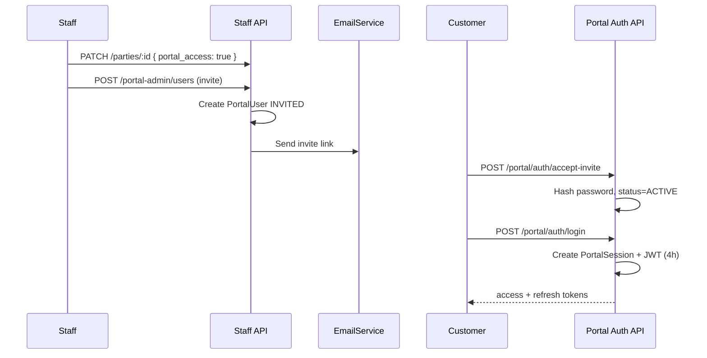
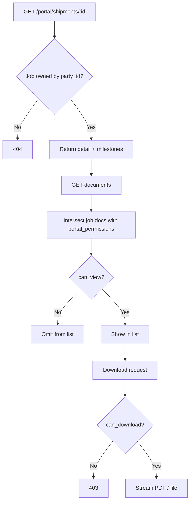
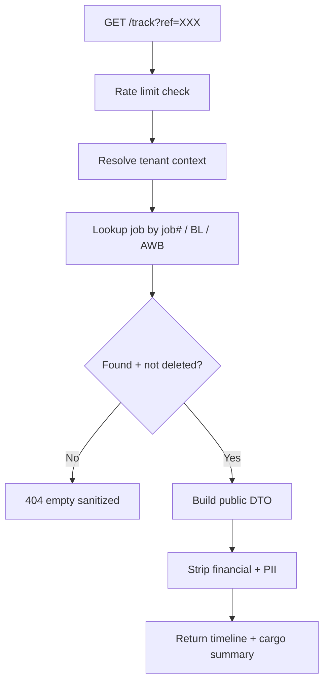
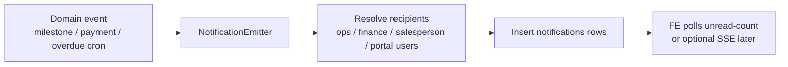
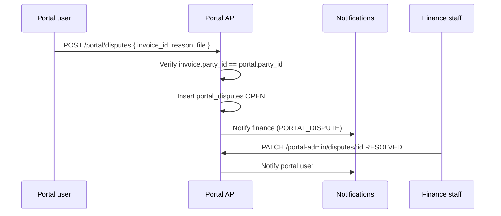

# Week 13 — Customer Portal · Track & Trace · In-app Notifications

**Project:** KingFisher Wings / Fresa Gold ERP (`fresa-gold-backend`)  
**Phase:** 2 — Full Platform (Weeks 13–21)  
**Spec:** Ch.24.1, Ch.24.2, Ch.19.5 (CCP), notification system from Week 13 plan  
**Source plan:** `Fresa_Gold_Complete_28Week_Plan.pdf` · `plan-summary.md`  
**Status:** Not started (prerequisite: Phase 1 Weeks 0–12 complete)  
**Audience:** Backend, frontend, QA, product  

---

## 1. Executive summary

Week 13 delivers three connected capabilities:

| Capability | Who uses it | Auth |
|------------|-------------|------|
| **Customer Web Portal (CCP)** | Customer contacts of parties with `portal_access` | Portal JWT (isolated from staff) |
| **Public Track & Trace** | Anyone with a job / BL / AWB reference | **Public** (`@Public()`) |
| **In-app notifications** | Staff (ERP topbar) + portal users (portal bell) | Staff JWT or Portal JWT |

**Weekly deliverable (from plan):** Customer Portal (Ch.24.1 + Ch.19.5) · Track & Trace public widget · In-app notifications (7 trigger types) · Per-customer document rights.

**Out of scope this week:** Vendor Payment Portal (VPP) → Week 14 · CRM → Week 14 · Air Import ops depth → Week 15.

---

## 2. Goals & non-goals

### Goals

1. Customers log in with **their own** credentials and see **only their** shipments, invoices, quotes, and documents.
2. Forwarder staff configure **which document types** each customer can view/download.
3. Public Track & Trace by job #, BL #, or AWB # with **tenant branding**, no staff data leakage.
4. In-app notifications with unread badge, mark-read, and click-through to entities.
5. CCP credit features: outstanding AR, aging statement, credit limit, disputes, credit-limit increase requests.

### Non-goals

- Vendor portal / remittance / purchase-invoice submit (Week 14).
- Real-time WebSocket push (v1 can poll; optional SSE later).
- WhatsApp delivery for portal events (existing stub; email + in-app first).
- Mobile app (Ch.26 deferred).
- Changing staff auth or RBAC model beyond new permissions.

---

## 3. Current codebase baseline

| Asset | State | Implication for Week 13 |
|-------|--------|-------------------------|
| `Party.portal_access` | Boolean flag exists | Gate for inviting / enabling portal users |
| Staff JWT + `Session` | Mature | Must **not** reuse for portal; separate issuer/audience |
| Jobs | `shipper_id`, `consignee_id`, milestones, docs | Portal “own shipments” filter rule needed (see §5.3) |
| Invoices / credit notes | `party_id` on invoice | Natural CCP ownership key |
| Quotations | `customer_id` | Portal quote list |
| GL AR aging / statements | Staff APIs exist | Reuse services behind portal guards |
| `portal_*` tables / modules | **None** | Greenfield modules |
| Notifications table | **None** | Greenfield; note in `admin-reset-password.dto` already anticipates it |

---

## 4. Architecture overview

```
┌──────────────────────────────────────────────────────────────────────────┐
│                         Clients                                          │
│  /(portal)/customer/*     Public /track widget     ERP staff app         │
└───────────┬───────────────────────┬──────────────────────┬───────────────┘
            │ Portal JWT            │ @Public()            │ Staff JWT
            ▼                       ▼                      ▼
┌─────────────────────┐   ┌─────────────────┐   ┌─────────────────────────┐
│ PortalAuthGuard     │   │ TrackController │   │ JwtAuthGuard + RBAC     │
│ scope=portal        │   │ rate-limited    │   │ NotificationsController │
└──────────┬──────────┘   └────────┬────────┘   └────────────┬────────────┘
           │                       │                         │
           ▼                       ▼                         ▼
┌─────────────────────┐   ┌─────────────────┐   ┌─────────────────────────┐
│ Portal* services    │   │ TrackService    │   │ NotificationService     │
│ (party_id scoped)   │   │ (sanitized DTO) │   │ (user_id / portal_user) │
└──────────┬──────────┘   └────────┬────────┘   └────────────┬────────────┘
           │                       │                         │
           └───────────────────────┴─────────────────────────┘
                                   │
                     Prisma + tenant RLS / explicit tenant_id
```

### Design principles

1. **Auth isolation** — Portal tokens never satisfy staff guards; staff tokens never satisfy portal guards.
2. **Ownership first** — Every portal query filters by `portal_user.party_id` (and `tenant_id`).
3. **Reuse domain services** — Prefer calling existing Jobs / Invoices / GL helpers with an injected `partyId` scope rather than duplicating business logic.
4. **Least privilege documents** — Even if a job has a PDF, `portal_permissions` must allow `can_view` / `can_download`.
5. **Public track is sanitized** — No costs, GP, internal notes, staff emails, or other parties’ PII.

---

## 5. Data model

### 5.1 New Prisma models (proposed)

```prisma
enum PortalUserStatus {
  INVITED
  ACTIVE
  DISABLED
}

enum PortalDocumentType {
  HAWB
  MAWB
  HBL
  MBL
  INVOICE
  CREDIT_NOTE
  STATEMENT
  CAN
  DO
  POD
  PRE_ALERT
  OTHER
}

enum NotificationType {
  INVOICE_OVERDUE
  JOB_MILESTONE_UPDATED
  QUOTATION_APPROVED
  QUOTATION_REJECTED
  PAYMENT_RECEIVED
  PDC_MATURITY_APPROACHING
  DOCUMENT_EXPIRY
  CREDIT_LIMIT_EXCEEDED
  PORTAL_MESSAGE
  PORTAL_DISPUTE
  CREDIT_LIMIT_REQUEST
}

enum PortalDisputeStatus {
  OPEN
  UNDER_REVIEW
  RESOLVED
  REJECTED
}

enum CreditLimitRequestStatus {
  PENDING
  APPROVED
  REJECTED
}

/// Customer portal login identity (linked to a Party).
model PortalUser {
  id            String           @id @default(dbgenerated("uuid_generate_v4()")) @db.Uuid
  tenant_id     String           @db.Uuid
  party_id      String           @db.Uuid
  email         String           @db.VarChar(255)
  password_hash String           @db.VarChar(255)
  full_name     String           @db.VarChar(200)
  phone         String?          @db.VarChar(30)
  status        PortalUserStatus @default(INVITED)
  last_login_at DateTime?        @db.Timestamptz
  invited_at    DateTime?        @db.Timestamptz
  activated_at  DateTime?        @db.Timestamptz
  created_at    DateTime         @default(now()) @db.Timestamptz
  updated_at    DateTime         @updatedAt @db.Timestamptz
  deleted_at    DateTime?        @db.Timestamptz

  party    Party            @relation(...)
  sessions PortalSession[]
  messages PortalMessage[]

  @@unique([tenant_id, email])
  @@index([tenant_id, party_id])
  @@map("portal_users")
}

model PortalSession {
  id               String    @id @default(dbgenerated("uuid_generate_v4()")) @db.Uuid
  jti              String    @unique @db.Uuid
  portal_user_id   String    @db.Uuid
  tenant_id        String    @db.Uuid
  refresh_hash     String    @db.VarChar(255)
  ip               String?   @db.VarChar(45)
  user_agent       String?   @db.VarChar(500)
  is_active        Boolean   @default(true)
  expires_at       DateTime  @db.Timestamptz
  revoked_at       DateTime? @db.Timestamptz
  created_at       DateTime  @default(now()) @db.Timestamptz

  portal_user PortalUser @relation(...)

  @@index([portal_user_id])
  @@map("portal_sessions")
}

/// Forwarder-configured document rights per customer party.
model PortalPermission {
  id            String             @id @default(dbgenerated("uuid_generate_v4()")) @db.Uuid
  tenant_id     String             @db.Uuid
  party_id      String             @db.Uuid
  document_type PortalDocumentType
  can_view      Boolean            @default(true)
  can_download  Boolean            @default(false)
  created_at    DateTime           @default(now()) @db.Timestamptz
  updated_at    DateTime           @updatedAt @db.Timestamptz

  @@unique([tenant_id, party_id, document_type])
  @@map("portal_permissions")
}

model PortalMessage {
  id             String    @id @default(dbgenerated("uuid_generate_v4()")) @db.Uuid
  tenant_id      String    @db.Uuid
  party_id       String    @db.Uuid
  portal_user_id String    @db.Uuid
  subject        String    @db.VarChar(200)
  body           String    @db.Text
  job_id         String?   @db.Uuid
  invoice_id     String?   @db.Uuid
  attachment_path String?  @db.VarChar(500)
  created_at     DateTime  @default(now()) @db.Timestamptz
  read_by_staff_at DateTime? @db.Timestamptz

  @@index([tenant_id, party_id, created_at])
  @@map("portal_messages")
}

model PortalDispute {
  id             String              @id @default(dbgenerated("uuid_generate_v4()")) @db.Uuid
  tenant_id      String              @db.Uuid
  party_id       String              @db.Uuid
  portal_user_id String              @db.Uuid
  invoice_id     String              @db.Uuid
  reason         String              @db.VarChar(200)
  description    String              @db.Text
  attachment_path String?            @db.VarChar(500)
  status         PortalDisputeStatus @default(OPEN)
  staff_notes    String?             @db.Text
  resolved_at    DateTime?           @db.Timestamptz
  created_at     DateTime            @default(now()) @db.Timestamptz
  updated_at     DateTime            @updatedAt @db.Timestamptz

  @@index([tenant_id, party_id, status])
  @@map("portal_disputes")
}

model CreditLimitRequest {
  id               String                   @id @default(dbgenerated("uuid_generate_v4()")) @db.Uuid
  tenant_id        String                   @db.Uuid
  party_id         String                   @db.Uuid
  portal_user_id   String                   @db.Uuid
  requested_limit  Decimal                  @db.Decimal(18, 2)
  current_limit    Decimal?                 @db.Decimal(18, 2)
  justification    String                   @db.Text
  status           CreditLimitRequestStatus @default(PENDING)
  reviewed_by      String?                  @db.Uuid
  reviewed_at      DateTime?                @db.Timestamptz
  review_notes     String?                  @db.Text
  created_at       DateTime                 @default(now()) @db.Timestamptz

  @@index([tenant_id, party_id, status])
  @@map("credit_limit_requests")
}

/// Staff and/or portal notifications.
model Notification {
  id          String           @id @default(dbgenerated("uuid_generate_v4()")) @db.Uuid
  tenant_id   String           @db.Uuid
  /// Staff user (ERP). Null when notification is for a portal user.
  user_id     String?          @db.Uuid
  /// Portal user. Null when notification is for staff.
  portal_user_id String?       @db.Uuid
  type        NotificationType
  title       String           @db.VarChar(200)
  message     String           @db.Text
  entity_type String?          @db.VarChar(50)  // job | invoice | quotation | payment | pdc | ...
  entity_id   String?          @db.Uuid
  link_path   String?          @db.VarChar(500) // FE route hint
  is_read     Boolean          @default(false)
  read_at     DateTime?        @db.Timestamptz
  created_at  DateTime         @default(now()) @db.Timestamptz

  @@index([tenant_id, user_id, is_read, created_at])
  @@index([tenant_id, portal_user_id, is_read, created_at])
  @@map("notifications")
}
```

### 5.2 Migration name (suggested)

`YYYYMMDDHHMMSS_week13_customer_portal_track_notifications`

### 5.3 Ownership rule (critical design decision)

Portal “my shipments” = jobs where the portal user’s `party_id` matches **any** of:

| Job field | When it applies |
|-----------|-----------------|
| `shipper_id` | Typical export customer |
| `consignee_id` | Typical import customer |
| Invoice `party_id` linked to job (optional enrichment) | Billing customer who is neither shipper nor consignee |

**Recommendation for v1:**  
`shipper_id = party_id OR consignee_id = party_id`  
Document this in Swagger. If product needs a dedicated `Job.customer_id`, add it as a small schema follow-up — do not invent silent matching.

Invoices / credit notes / statements / quotes: filter by `party_id` / `customer_id` = portal `party_id`.

---

## 6. Module layout (backend)

Follow `docs/module-template.md` Pattern D where lists are heavy.

```
src/modules/portal/
├── portal.module.ts
├── auth/
│   ├── portal-auth.controller.ts      # login, refresh, logout, accept-invite
│   ├── portal-auth.service.ts
│   ├── portal-jwt.strategy.ts
│   ├── portal-auth.guard.ts
│   └── dto/
├── users/                             # staff admin: invite / disable portal users
│   ├── portal-users.controller.ts     # under staff auth
│   └── ...
├── shipments/
│   ├── portal-shipments.controller.ts
│   └── portal-shipments.service.ts
├── documents/
│   ├── portal-documents.controller.ts
│   └── portal-documents.service.ts
├── invoices/                          # CCP
│   ├── portal-invoices.controller.ts
│   └── portal-invoices.service.ts
├── credit/
│   ├── portal-credit.controller.ts    # limit, aging, disputes, credit-limit requests
│   └── ...
├── messages/
│   └── portal-messages.controller.ts
├── quotations/
│   └── portal-quotations.controller.ts
├── permissions/                       # staff: configure portal_permissions
│   └── portal-permissions.controller.ts
└── constants/
    └── portal-permission.constants.ts

src/modules/track/
├── track.module.ts
├── track.controller.ts                # @Public() GET /track
├── track-widget.controller.ts         # GET /track/widget.js or /track/embed
└── track.service.ts

src/modules/notifications/
├── notifications.module.ts
├── notifications.controller.ts        # staff
├── portal-notifications.controller.ts # portal
├── notifications.service.ts
├── notification-emitter.service.ts    # called from jobs/invoices/gl/quotes
└── constants/
```

Register in `app.module.ts`. Add permissions to `permission-catalog.ts` + `role-catalog.ts`, then `POST /tenants/:id/sync-permissions`.

---

## 7. Auth & security

### 7.1 Portal JWT

| Property | Value |
|----------|--------|
| Access TTL | **4 hours** (per plan) |
| Refresh | Only via portal refresh endpoint; rotate refresh hash |
| Claims | `sub` = portal_user.id, `tenantId`, `partyId`, `scope: 'portal'`, `sessionId` (jti) |
| Secret | Prefer dedicated `PORTAL_JWT_SECRET` (fallback: staff secret + different `aud`/`iss`) |
| Guard | `PortalAuthGuard` — reject if `scope !== 'portal'` |
| Staff guard | Reject if token has `scope === 'portal'` |

### 7.2 Invite flow

1. Staff enables `Party.portal_access = true`.
2. Staff invites portal user: email + party_id → create `PortalUser` (`INVITED`) + email link token.
3. Customer accepts invite → set password → `ACTIVE`.
4. Login creates `PortalSession` + token pair.

### 7.3 Public Track & Trace

- `@Public()` + **strict rate limit** (e.g. 30 req/min/IP).
- Resolve `ref` against: `job_number`, HAWB/MAWB / HBL/MBL numbers (existing doc fields / AWB stock).
- Response whitelist only: status, milestones (code + completed_at), ETD/ETA, origin/dest names, pieces/weight/cbm summary, carrier/flight or vessel/voyage if present.
- **Never** return: charges, costs, GP, internal notes, other party contacts, invoice amounts, staff names.
- Optional query: `?tenant=` slug or subdomain mapping so multi-tenant public URLs resolve correctly.

### 7.4 Isolation tests (must pass)

| Test | Expected |
|------|----------|
| Customer A token + Customer B job id | 404 (not 403, to avoid ID oracle) |
| Staff JWT on `/portal/*` | 401 |
| Portal JWT on `/jobs` staff API | 401 |
| Doc download without `can_download` | 403 |
| Track ref for other tenant | empty / 404 |

---

## 8. API surface (proposed)

Base paths are suggestions — keep consistent with existing `/api` prefix and Swagger tags.

### 8.1 Portal auth (`@Public` where noted)

| Method | Path | Auth | Purpose |
|--------|------|------|---------|
| POST | `/portal/auth/login` | Public | Email + password → tokens |
| POST | `/portal/auth/refresh` | Public | Refresh pair |
| POST | `/portal/auth/logout` | Portal | Revoke session |
| POST | `/portal/auth/accept-invite` | Public | Activate invite + set password |
| GET | `/portal/auth/me` | Portal | Profile + party summary |

### 8.2 Portal shipments & documents

| Method | Path | Purpose |
|--------|------|---------|
| GET | `/portal/shipments` | List own jobs (status, ETD/ETA, job_type) |
| GET | `/portal/shipments/:id` | Detail + milestone timeline |
| GET | `/portal/shipments/:id/documents` | Docs filtered by `portal_permissions` |
| GET | `/portal/shipments/:id/documents/:docId/download` | Download if `can_download` |

### 8.3 Portal finance (CCP)

| Method | Path | Purpose |
|--------|------|---------|
| GET | `/portal/invoices` | Own invoices + due dates + status |
| GET | `/portal/invoices/:id` | Detail |
| GET | `/portal/invoices/:id/pdf` | PDF if permitted |
| GET | `/portal/credit-notes` | Applied credit notes |
| GET | `/portal/payments` | Payment history for party |
| GET | `/portal/credit/summary` | Credit limit, used, available |
| GET | `/portal/credit/aging` | Aging buckets |
| GET | `/portal/credit/statement.pdf` | Aging / account statement PDF |
| POST | `/portal/credit/limit-requests` | Request higher limit |
| POST | `/portal/disputes` | Raise invoice dispute |
| GET | `/portal/disputes` | Own disputes |

### 8.4 Portal quotes & messages

| Method | Path | Purpose |
|--------|------|---------|
| GET | `/portal/quotations` | Quotes sent to this customer (read-only) |
| GET | `/portal/quotations/:id` | Detail (no internal cost if policy says so) |
| POST | `/portal/messages` | Contact forwarder |
| GET | `/portal/messages` | Own sent messages |

### 8.5 Staff admin (portal config)

| Method | Path | Permission | Purpose |
|--------|------|------------|---------|
| POST | `/portal-admin/users` | `portal.manage_users` | Invite portal user |
| PATCH | `/portal-admin/users/:id` | `portal.manage_users` | Disable / rename |
| GET | `/portal-admin/users` | `portal.manage_users` | List by party |
| GET/PUT | `/portal-admin/parties/:partyId/permissions` | `portal.manage_permissions` | Doc rights matrix |
| GET | `/portal-admin/messages` | `portal.view_messages` | Inbox from customers |
| PATCH | `/portal-admin/disputes/:id` | `portal.manage_disputes` | Resolve dispute |
| PATCH | `/portal-admin/credit-limit-requests/:id` | `portal.manage_credit` | Approve/reject |

### 8.6 Public track

| Method | Path | Purpose |
|--------|------|---------|
| GET | `/track?ref=` | JSON timeline (public) |
| GET | `/track/embed` | HTML/JS snippet with tenant branding |

### 8.7 Notifications

| Method | Path | Auth | Purpose |
|--------|------|------|---------|
| GET | `/notifications` | Staff | Paginated, unread first |
| GET | `/notifications/unread-count` | Staff | Badge |
| POST | `/notifications/:id/read` | Staff | Mark one |
| POST | `/notifications/read-all` | Staff | Mark all |
| GET | `/portal/notifications` | Portal | Same shape for portal user |
| POST | `/portal/notifications/:id/read` | Portal | Mark one |
| POST | `/portal/notifications/read-all` | Portal | Mark all |

---

## 9. End-to-end flows

### 9.1 Enable customer + first login



### 9.2 Portal shipment + document download



### 9.3 Public Track & Trace



### 9.4 Notification trigger pipeline



### 9.5 CCP dispute



---

## 10. In-app notification triggers (7 + portal extras)

| # | Type | When | Primary recipients |
|---|------|------|--------------------|
| 1 | `INVOICE_OVERDUE` | Overdue cron (existing invoice cron) | Finance role / users |
| 2 | `JOB_MILESTONE_UPDATED` | Milestone complete/update | `ops_user_id` + optional salesperson |
| 3 | `QUOTATION_APPROVED` / `QUOTATION_REJECTED` | Quote approval workflow | Salesperson |
| 4 | `PAYMENT_RECEIVED` | Payment posted | Finance |
| 5 | `PDC_MATURITY_APPROACHING` | PDC cron (e.g. T-3 days) | Finance |
| 6 | `DOCUMENT_EXPIRY` | Placeholder hook (HR docs Week 16) — implement emitter interface now; may no-op until HR | HR role if present |
| 7 | `CREDIT_LIMIT_EXCEEDED` | Invoice create/post when AR > limit | Finance |

**Portal-originated (also Week 13):**

| Type | When | Recipients |
|------|------|------------|
| `PORTAL_MESSAGE` | Customer contacts forwarder | CS / ops for party |
| `PORTAL_DISPUTE` | Dispute raised | Finance |
| `CREDIT_LIMIT_REQUEST` | Limit increase requested | Finance / Tenant Admin |

**Integration pattern:** emit from existing services (`jobs`, `invoices`, `gl/payments`, `quotations`, scheduler crons) via `NotificationEmitter` — avoid circular module imports (use forwardRef or a thin shared events module).

---

## 11. Permissions catalog (staff)

Add to `permission-catalog.ts` / role defaults:

| Permission | Purpose | Suggested roles |
|------------|---------|-----------------|
| `portal.manage_users` | Invite/disable portal users | Tenant Admin, CS |
| `portal.manage_permissions` | Doc rights matrix | Tenant Admin, CS |
| `portal.view_messages` | Read contact-forwarder inbox | Tenant Admin, CS, Ops |
| `portal.manage_disputes` | Resolve disputes | Tenant Admin, Finance |
| `portal.manage_credit` | Approve credit-limit requests | Tenant Admin, Finance |
| `notifications.view` | Own notification list (all staff) | All staff roles |

Portal users do **not** use RBAC permissions; access is entirely party-scoped + `portal_permissions`.

---

## 12. Frontend scope (for team alignment)

Even if this repo is backend-first, FE needs parallel work:

| Area | Routes / UI |
|------|-------------|
| Portal shell | `/(portal)/customer` — login, layout, logout |
| Dashboard | Shipment counts by status, outstanding AR summary |
| Shipments | List + detail with milestone timeline |
| Documents | Permission-aware list + download |
| Invoices / CCP | Invoices, payments, credit gauge, aging PDF, dispute form, limit request |
| Quotations | Read-only list/detail |
| Contact | Message form (+ optional attachment) |
| Public track | `/track` page + embeddable widget snippet |
| Staff ERP | Notification bell (badge + last 10), notifications page, portal admin screens (users, permissions, disputes) |

**Branding:** Public widget uses **tenant/company** logo/colors — no Fresa/KingFisher marketing chrome on customer-facing embed.

---

## 13. Day-by-day delivery plan (from 28-week PDF)

Assumes 2 developers (DEV1 backend, DEV2 frontend/QA). Adjust if backend-only sprint.

| Day | DEV1 (Backend) | DEV2 (Frontend / QA) |
|-----|----------------|----------------------|
| **Mon** | Portal auth + sessions + JWT; shipment list/detail/milestones; invoice list/PDF hooks | Portal login + dashboard + shipment list/detail timeline |
| **Tue** | `portal_permissions`; messages; public `GET /track` + embed payload | Invoice/outstanding UI; contact form; public track page |
| **Wed** | Notifications table + APIs + wire 7 emitters; permissions admin API | Notification bell + list page; portal doc-rights admin UI |
| **Thu** | CCP: credit summary, aging PDF, disputes, limit requests, quotations | Credit & payments page; dispute + limit forms; quotations view |
| **Fri** | Isolation + notification integration tests; bugfix | Full portal E2E QA; permission matrix QA; track ref types QA |
| **Sat** | Sign-off · Swagger complete · sync-permissions | Stakeholder demo · board update |

---

## 14. Implementation checklist (backend)

### Schema & module bootstrap

- [ ] Prisma models + migration
- [ ] Relations on `Party`, `Tenant`, optional `Job`/`Invoice`
- [ ] `PortalModule`, `TrackModule`, `NotificationsModule` registered
- [ ] Env: `PORTAL_JWT_SECRET`, access/refresh TTLs
- [ ] Permission catalog + role defaults + sync endpoint usage

### Auth

- [ ] Invite + accept-invite + login/refresh/logout/me
- [ ] `PortalAuthGuard` + strategy; staff/portal mutual exclusion
- [ ] Session revocation on logout / password change

### Portal domain

- [ ] Shipments ownership filter
- [ ] Documents gated by permissions
- [ ] Invoices, credit notes, payments, statement PDF
- [ ] Credit summary + aging
- [ ] Disputes + credit-limit requests
- [ ] Quotations read-only
- [ ] Contact forwarder messages
- [ ] Staff admin APIs

### Track & Trace

- [ ] Ref resolution (job #, BL #, AWB #)
- [ ] Sanitized DTO
- [ ] Rate limiting
- [ ] Embed/widget endpoint

### Notifications

- [ ] CRUD-ish read/mark APIs (staff + portal)
- [ ] Emitter + 7 triggers wired
- [ ] Portal message/dispute/limit request notifications

### Docs & QA

- [ ] Swagger tags + examples
- [ ] Update `plan-summary.md` Week 13 → Done when signed off
- [ ] Security test pack (§7.4)
- [ ] Live/API regression for existing staff routes (no regressions)

---

## 15. Acceptance criteria (sign-off)

1. Customer can log in only if invited and `portal_access` is true for their party.
2. Customer sees **only** own shipments/invoices/quotes; cross-tenant and cross-party access returns 404.
3. Document list/download respects per-type `can_view` / `can_download`.
4. Public `/track?ref=` works for job #, BL #, and AWB # and never leaks financials.
5. Embed widget renders with company branding only.
6. All 7 staff notification types can be produced by their domain events/crons (HR expiry may be stubbed with a unit-testable emitter).
7. CCP: view outstanding, download statement, raise dispute, request credit limit increase.
8. Portal JWT expires at 4h; refresh works; staff JWT cannot call portal routes.
9. Swagger documents all portal/track/notification endpoints.
10. Stakeholder demo completed (login → shipments → track → invoices → aging → dispute → quotes → contact).

---

## 16. Risks & mitigations

| Risk | Impact | Mitigation |
|------|--------|------------|
| Ambiguous “customer” on job (shipper vs consignee vs bill-to) | Wrong shipments shown | Codify v1 rule in §5.3; product sign-off day 1 |
| Multi-tenant public `/track` without tenant hint | Wrong or ambiguous job | Require tenant slug / host header mapping |
| Notification emitter circular deps | Build/runtime errors | Shared `NotificationsModule` exports only emitter; domain modules import it |
| PDF download auth for portal | Staff-only storage paths | Portal download service reuses storage with permission check, never expose raw paths |
| Rate-limit abuse on `/track` | Cost / scraping | Throttle + captcha later if needed |
| Existing live-test suite | New public routes may false-fail | Mark `/track` and portal auth as public in suite (same pattern as locale/accept-invite) |

---

## 17. Dependencies on existing modules

| Module | Reuse |
|--------|--------|
| `parties` | `portal_access`, party profile, credit_limit |
| `jobs` | List/detail, milestones, document metadata |
| `invoices` | List/PDF, credit notes, overdue cron hook |
| `gl` | AR aging, payments history, statement PDF helpers |
| `quotations` | Customer quote list |
| `auth` patterns | Session/jti/refresh hashing patterns (copy, don’t share tables) |
| `shared/email` | Invite + optional email on portal message |
| `shared/pdf` | Statement / invoice PDF |
| `scheduler` | Overdue + PDC maturity → notification emitters |

---

## 18. Definition of Done

Week 13 is **Done** when:

- Migration applied on shared/dev environments  
- All checklist items in §14 complete  
- Acceptance criteria §15 signed by tech lead + product  
- `plan-summary.md` Week 13 status updated to **Done**  
- Demo recorded / notes for Week 14 (VPP + CRM) handoff  

---

## 19. Handoff to Week 14

Week 14 builds on this foundation:

- Mirror portal patterns for **Vendor Payment Portal** (`vendor_portal_sessions`, vendor permissions).
- Reuse notification emitter for vendor/CRM events.
- Do **not** overload `PortalUser` for vendors — keep separate vendor identity tables.

---

## 20. Quick reference — team roles

| Role | Owns |
|------|------|
| Backend lead | Schema, auth isolation, ownership rules, emitters |
| Backend eng | Portal CRUD APIs, track service, admin APIs |
| Frontend | Portal UI, track page/widget, notification bell, admin screens |
| QA | Isolation matrix, permission matrix, track ref types, E2E demo script |
| Product | Confirm §5.3 ownership rule + which doc types default on/off |

---

*Document generated for Week 13 planning. Align implementation with `docs/module-template.md`, `docs/api-response-standard.md`, and existing JWT/session patterns in `src/modules/auth`.*
